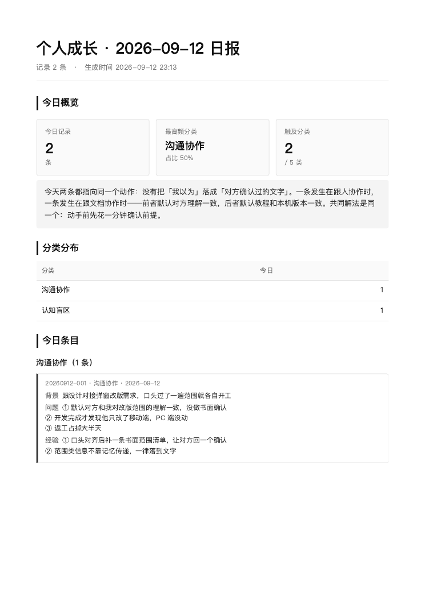

# personal-os · 个人反思操作系统

一个 [Claude Code](https://claude.com/claude-code) Skill：把日常失误结构化沉淀成一本长期总账，再按日 / 周把它折叠成一份能看出模式的 PDF。

重点不是"记下来"，而是**跨周期看重复**——同一类错犯到第三次时，它应该在报告里显形。

## 它能做什么

| 你说 | 它做 |
|---|---|
| 「今天做错了一件事 / 记一笔」 | 结构化抽取 + 分类，追加到长期总账 `犯错总账.md` |
| 「出日报 / 今日复盘」 | 生成当日反思日报 PDF |
| 「出周报 / 出反思周报」 | 按 Dubai Week 提取本周条目，找出反复犯错的通性，生成周报 PDF |

---

## 日常用法：说完话，出一份 PDF

这个 skill 是为**语音输入**设计的。不需要自己整理格式——像发微信语音一样把今天的事说完就行，结构化由 Claude 完成。

1. 在 Claude Code（或 Codex 之类）的对话框里，**按住 `fn`** 启动 macOS 微信的听写
2. 把今天这件事**一口气说完**，不用管顺序和措辞
3. 松开 `fn`，识别出的文字落进对话框，回车发送
4. Claude 抽取字段 → 判分类 → 入库，回执给你条目 id 和润色后的版本
5. 再说一句「**出日报**」，拿到 PDF

> macOS 听写默认是按 `fn` 两下开启。改成"按住说话"：系统设置 → 键盘 → 听写 → 快捷键，选 `按住 fn`。

语音输入难免有错字和口语废话，所以入库时**默认开启润色**：改错字病句、口语化转准确词、统一序号。但它有硬边界——**不会增加你没说的内容，不会替你脑补根因，不会合并或拆分你的分点**。

---

## 输入格式：三个字段

每条记录只有三个你需要提供的字段，其余（id、日期、分类）自动补：

| 字段 | 在 PDF 里显示为 | 你要说的 |
|---|---|---|
| `context` | **背景** | 这事发生在什么场景、跟谁、在做什么 |
| `problem` | **问题** | 具体哪里错了，造成了什么后果 |
| `experience` | **经验** | 下次遇到同类情况，具体怎么做 |

顺着「**背景 → 问题 → 经验**」说就行，不用报字段名。

### 怎么说效果更好

**一件事一条。** 三件不相干的事塞进一条，分类和周报统计都会失真。分开说三次。

**问题和经验分点说。** 口头说「第一…第二…第三…」，Claude 会转成 `① ② ③`，PDF 里会自动分行。混成一大段就只能挤成一行。

**经验要写成"下次的动作"，不是感想。** 这是这套东西有用和没用的分界线：

| ❌ 感想 | ✅ 动作 |
|---|---|
| 以后要多沟通 | 口头对齐后补一条书面范围清单，让对方回一个"确认" |
| 下次仔细点 | 命令行报错先跑 `--version` 对齐文档版本，再查其他 |
| 要控制情绪 | 情绪上来时先离开工位十分钟，不在当场回消息 |

判断标准：**一周内能验证自己做没做到。**

**说不出经验就别硬凑。** 留空比编一条正确的废话好——它还会污染你的周报统计。

**数字和人名复述一遍。** 其他错字润色能兜住，这两类兜不住。

---

## 一个完整样例

**① 你对着麦克风说的原话**（语音识别后，未整理）：

```
今天跟设计对弹窗改版的需求，口头过了一遍范围就各自开工了，我以为他知道
要改哪些，结果开发完了才发现他只改了移动端，PC 端一点没动，返工占掉大半天。
其实一开始就应该把范围写下来发给他确认一遍，不能默认对方脑子里跟我想的一样。
```

**② Claude 抽取的结构**：

```json
{
  "date": "2026-09-12",
  "context": "跟设计对接弹窗改版需求，口头过了一遍范围就各自开工",
  "problem": "① 默认对方和我对改版范围的理解一致，没做书面确认 ② 开发完成才发现他只改了移动端，PC 端没动 ③ 返工占掉大半天",
  "experience": "① 口头对齐后补一条书面范围清单，让对方回一个确认 ② 范围类信息不靠记忆传递，一律落到文字",
  "category": "communication"
}
```

`id` 和 `category` 你都不用给：`id` 由脚本按 `YYYYMMDD-NNN` 生成，`category` 由 Claude 从 5 类里判一个（分类不明时会反问你一次）。

**③ 落进总账的一行**：

```
| 20260912-001 | 2026-09-12 | communication | 跟设计对接弹窗改版需求… | ① 默认对方… | ① 口头对齐后… |
```

---

## 输出长什么样

说一句「出日报」，拿到这个。下面是一份**真实日报**，人名和业务信息已脱敏：



完整 PDF（2 页，含 3 条完整条目和明日建议）：[`examples/sample-daily-report.pdf`](examples/sample-daily-report.pdf)

版面固定四块：**今日概览**（数字卡片 + Claude 写的总评）、**分类分布**、**今日条目**（按分类分组）、**明日可执行建议**（≤3 条，每条一周内可验证）。周报同构，把"今日"换成 Dubai Week 区间。

值得看的是总评那段。这天三条全归入「认知盲区」，而且都是**方法论吸收**而不是实际失误——总评直接点出这个性质，并且提醒"16 条新方法记下来不算长本事，明天能用上 1 条才算"。这就是总评该干的事：不复述条目，而是指出今天这批记录的共同性质，以及它暴露的倾向。

---

## 周次体系：Dubai Week

报告不用 ISO 周，也不用月内周，而是自定义的 **Dubai Week**（`DW1` `DW2` …）：以周日为一周起点，锚点 `DW1 = 2026-04-19`。日期计算统一收敛在 [`scripts/lib_dates.py`](scripts/lib_dates.py)，并强制以 `TZ='Asia/Dubai'` 现场采集当天日期，避免模型凭上下文里的过期日期做心算。

改锚点或改时区，只需要动 `lib_dates.py` 一处。

## 目录结构

```
personal-os/
├── SKILL.md                  # 主流程定义（触发词路由 + 流程 A/B/C）
├── scripts/
│   ├── lib_dates.py          # Dubai Week 共享日期工具
│   ├── append_entry.py       # 反思入库
│   ├── analyze_daily.py      # 当日条目聚合
│   ├── analyze_weekly.py     # 本周条目聚合
│   └── render_pdf.py         # 日报 / 周报 PDF 渲染
├── references/categories.md  # 反思 5 分类定义
├── assets/pdf-style.css      # 极简风 PDF 样式
├── examples/                 # 日报样例 PDF + 预览图
└── data/                     # 占位目录（真实数据存在 skill 外部）
```

## 安装

把 `personal-os/` 放进 Claude Code 的 skills 目录：

```bash
git clone https://github.com/b-bzy/personal-os.git ~/.claude/skills/personal-os
```

PDF 渲染需要 weasyprint：

```bash
pip install weasyprint
```

其余脚本只用 Python 3 标准库（需要 3.9+，用到了 `zoneinfo`）。

## 数据存在哪

**真实数据不在这个仓库里。** 脚本按以下顺序定位总账文件：

1. 环境变量 `PG_TOTAL_LEDGER`（推荐显式设置）
2. `~/Desktop/工作报告/个人成长/犯错总账.md`
3. 都不存在时，回退到 skill 内部的 `data/mistakes.md`

```bash
export PG_TOTAL_LEDGER="$HOME/your/path/犯错总账.md"
```

仓库里的 `data/` 只有占位文件，不含任何真实记录。

## 定制

- **改分类**：[`references/categories.md`](references/categories.md)（5 分类的定义与归类优先级）
- **改样式**：[`assets/pdf-style.css`](assets/pdf-style.css)
- **改周次锚点 / 时区**：[`scripts/lib_dates.py`](scripts/lib_dates.py)
